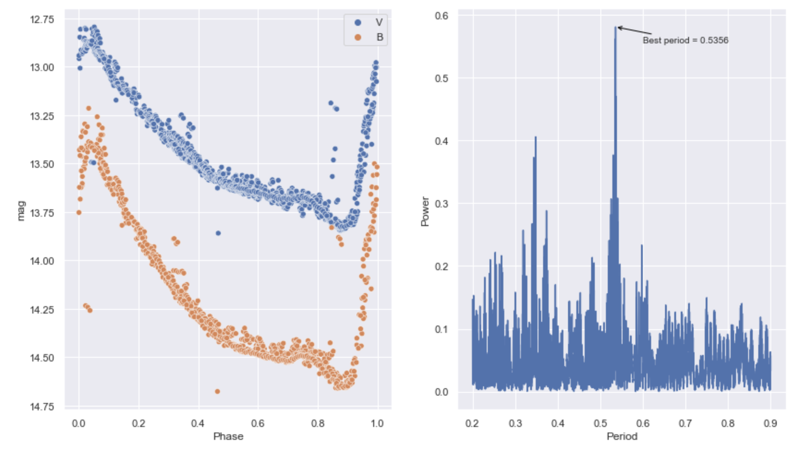
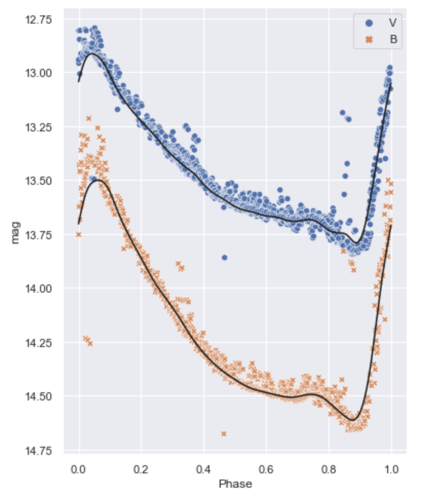

# Light-Curve-Fitting

Routines to find the period of periodic variable stars, and to derive a smoothed light curve fit. 

### Example

```python
import lcv_fitting as lcv 

filters, data = lcv.read_lcv('test_lcvs/NGC6121_V2.lcv')
best_period = lcv.get_gatspy_period(data)
```


```python 
import matplotlib.pyplot as plt 

fig, ax = plt.subplots(1,1, figsize=(6, 8))

lcv.phase_lcv(data_subset, 'test', best_period, plot=1, ax=ax, errorbars=False)

filt = ['B', 'V']
for i in range(2): 
    data_this_filter = data[data['filter'] == filt[i]]
    
    t, tt, ttt = lcv.lcv_gloess(data_this_filter, best_period, make_plot=False, min_n_obs=12, max_delta_phase=0.2)
    ax.plot(ttt['phase'], ttt['mag'], color='k')
    
ax.invert_yaxis()
ax.set_xlabel('Phase')
ax.set_ylabel('mag')
```

